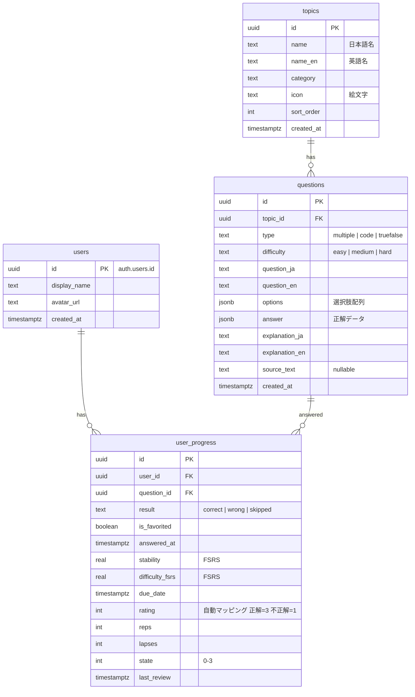

# TechPrep DB設計書

> Supabase (PostgreSQL) | 仕様書 v1.2 準拠 | 2026年3月

---

## 1. ER図



---

## 2. テーブル定義

### 2-1. users

Supabase Auth のユーザーと 1:1 対応。Auth トリガーで自動挿入される。

| カラム | 型 | 制約 | デフォルト | 説明 |
|---|---|---|---|---|
| id | `uuid` | PK | — | `auth.users.id` と同値 |
| display_name | `text` | — | `''` | Google アカウント表示名 |
| avatar_url | `text` | — | `''` | Google アバター URL |
| created_at | `timestamptz` | NOT NULL | `now()` | 登録日時 |

### 2-2. topics

問題のカテゴリ。管理者が service_role 経由で管理する。

| カラム | 型 | 制約 | デフォルト | 説明 |
|---|---|---|---|---|
| id | `uuid` | PK | `gen_random_uuid()` | — |
| name | `text` | NOT NULL | — | トピック名（日本語） |
| name_en | `text` | NOT NULL | `''` | トピック名（英語） |
| category | `text` | NOT NULL | — | 例: JavaScript / TypeScript |
| icon | `text` | — | `''` | 絵文字アイコン |
| sort_order | `int` | NOT NULL | `0` | 表示順 |
| created_at | `timestamptz` | NOT NULL | `now()` | 作成日時 |

**インデックス:**
- `idx_topics_category` — `category`（カテゴリ別フィルタ用）

### 2-3. questions

クイズ問題。1 トピックに複数問題が紐づく。

| カラム | 型 | 制約 | デフォルト | 説明 |
|---|---|---|---|---|
| id | `uuid` | PK | `gen_random_uuid()` | — |
| topic_id | `uuid` | FK → topics.id, NOT NULL | — | 所属トピック |
| type | `text` | NOT NULL, CHECK (`type IN ('multiple','code','truefalse')`) | — | 問題形式 |
| difficulty | `text` | NOT NULL, CHECK (`difficulty IN ('easy','medium','hard')`) | — | 難易度 |
| question_ja | `text` | NOT NULL | — | 問題文（日本語） |
| question_en | `text` | NOT NULL | `''` | 問題文（英語） |
| options | `jsonb` | — | `NULL` | 選択肢（multiple/code のみ） |
| answer | `jsonb` | NOT NULL | — | 正解データ |
| explanation_ja | `text` | NOT NULL | `''` | 解説（日本語） |
| explanation_en | `text` | NOT NULL | `''` | 解説（英語） |
| source_text | `text` | — | `NULL` | AI 生成元テキスト |
| created_at | `timestamptz` | NOT NULL | `now()` | 作成日時 |

**インデックス:**
- `idx_questions_topic_id` — `topic_id`（トピック別一覧取得用）
- `idx_questions_topic_difficulty` — `(topic_id, difficulty)`（トピック×難易度フィルタ用）

### 2-4. user_progress

ユーザーごとの問題回答履歴 + FSRS パラメータ。`(user_id, question_id)` で UNIQUE 制約を持ち、upsert パターンで更新する。

| カラム | 型 | 制約 | デフォルト | 説明 |
|---|---|---|---|---|
| id | `uuid` | PK | `gen_random_uuid()` | — |
| user_id | `uuid` | FK → users.id, NOT NULL | — | 回答ユーザー |
| question_id | `uuid` | FK → questions.id, NOT NULL | — | 対象問題 |
| result | `text` | NOT NULL, CHECK (`result IN ('correct','wrong','skipped')`) | — | 最新の回答結果 |
| is_favorited | `boolean` | NOT NULL | `false` | 苦手フラグ |
| answered_at | `timestamptz` | NOT NULL | `now()` | 最新回答日時 |
| stability | `real` | — | `NULL` | FSRS 安定性 |
| difficulty_fsrs | `real` | — | `NULL` | FSRS 難易度 |
| due_date | `timestamptz` | — | `NULL` | 次回復習日 |
| rating | `int` | CHECK (`rating BETWEEN 1 AND 4`) | `NULL` | 自動マッピング（正解=3, 不正解=1） |
| reps | `int` | NOT NULL | `0` | 復習回数 |
| lapses | `int` | NOT NULL | `0` | 忘却回数 |
| state | `int` | NOT NULL, CHECK (`state BETWEEN 0 AND 3`) | `0` | FSRS カード状態 |
| last_review | `timestamptz` | — | `NULL` | 最終復習日時 |

**制約:**
- `UNIQUE(user_id, question_id)` — 1ユーザー1問題につき1レコード

**インデックス:**
- `idx_user_progress_user_id` — `user_id`（ユーザー別進捗取得用）
- `idx_user_progress_due` — `(user_id, due_date)` WHERE `due_date IS NOT NULL`（今日の復習クエリ用、部分インデックス）
- `idx_user_progress_favorites` — `(user_id)` WHERE `is_favorited = true`（苦手一覧用、部分インデックス）

---

## 3. JSONB カラムスキーマ

### 3-1. questions.options

`type = 'multiple'` または `type = 'code'` の場合に使用する。`type = 'truefalse'` の場合は `NULL`。

```jsonc
// multiple の例
[
  { "label": "A", "text_ja": "コールスタック", "text_en": "Call Stack" },
  { "label": "B", "text_ja": "タスクキュー",   "text_en": "Task Queue" },
  { "label": "C", "text_ja": "ヒープ",         "text_en": "Heap" },
  { "label": "D", "text_ja": "スコープチェーン", "text_en": "Scope Chain" }
]

// code の例（出力を選ぶ形式）
[
  { "label": "A", "text_ja": "undefined",  "text_en": "undefined" },
  { "label": "B", "text_ja": "null",       "text_en": "null" },
  { "label": "C", "text_ja": "ReferenceError", "text_en": "ReferenceError" },
  { "label": "D", "text_ja": "0",          "text_en": "0" }
]
```

### 3-2. questions.answer

問題タイプごとに構造が異なる。

```jsonc
// multiple / code — 正解の選択肢インデックス（0始まり）
{ "correct_index": 1 }

// truefalse — 正解の真偽値
{ "correct_value": true }
```

---

## 4. RLS ポリシー

Supabase の Row Level Security を使用してアクセス制御を実装する。管理者操作は `service_role` キーで RLS をバイパスする。

> **パフォーマンス注意**: `auth.uid()` を直接 WHERE 句で使用すると行ごとに関数呼び出しが発生する。`(SELECT auth.uid())` でサブクエリ化することで1回の評価に最適化する。

### topics

| ポリシー | 操作 | ロール | 条件 |
|---|---|---|---|
| `topics_select_public` | SELECT | `anon, authenticated` | `true`（全件公開） |

> INSERT/UPDATE/DELETE は `service_role`（管理者）のみ。RLS バイパスのためポリシー不要。

### questions

| ポリシー | 操作 | ロール | 条件 |
|---|---|---|---|
| `questions_select_public` | SELECT | `anon, authenticated` | `true`（全件公開） |

> INSERT/UPDATE/DELETE は `service_role`（管理者）のみ。

### users

| ポリシー | 操作 | ロール | 条件 |
|---|---|---|---|
| `users_select_own` | SELECT | `authenticated` | `id = (SELECT auth.uid())` |
| `users_update_own` | UPDATE | `authenticated` | `id = (SELECT auth.uid())` |

> INSERT はトリガー経由（service_role）。DELETE は不要（退会機能なし）。

### user_progress

| ポリシー | 操作 | ロール | 条件 |
|---|---|---|---|
| `user_progress_select_own` | SELECT | `authenticated` | `user_id = (SELECT auth.uid())` |
| `user_progress_insert_own` | INSERT | `authenticated` | `user_id = (SELECT auth.uid())` |
| `user_progress_update_own` | UPDATE | `authenticated` | `user_id = (SELECT auth.uid())` |

> DELETE は不要（進捗は削除しない）。

---

## 5. Supabase Auth 連携

### 5-1. ユーザー自動作成トリガー

Auth でユーザーが作成されると `users` にレコードを自動挿入する。

```sql
CREATE OR REPLACE FUNCTION public.handle_new_user()
RETURNS TRIGGER
LANGUAGE plpgsql
SECURITY DEFINER
SET search_path = ''
AS $$
BEGIN
  INSERT INTO public.users (id, display_name, avatar_url)
  VALUES (
    NEW.id,
    COALESCE(NEW.raw_user_meta_data ->> 'full_name', ''),
    COALESCE(NEW.raw_user_meta_data ->> 'avatar_url', '')
  );

  RETURN NEW;
END;
$$;

CREATE TRIGGER on_auth_user_created
  AFTER INSERT ON auth.users
  FOR EACH ROW
  EXECUTE FUNCTION public.handle_new_user();
```

### 5-2. 言語設定

言語切り替え（ja / en）はフロントエンドのみで管理する。`localStorage` に保存し、ヘッダーのタブ UI で切り替える。DB には持たせない。

### 5-3. 管理者認証戦略

| 項目 | 方針 |
|---|---|
| 認証方式 | Supabase Auth メール+パスワード |
| アカウント作成 | Supabase ダッシュボードで1件手動作成 |
| API アクセス | サーバーサイド（Next.js Route Handler）で `service_role` キーを使用 |
| RLS | `service_role` は RLS を自動バイパス — 管理者用ポリシーは不要 |
| フロントエンド判定 | `/admin` ルートのアクセス制御は Next.js middleware でメールアドレスを検証 |

---

## 6. SQL マイグレーション

Supabase SQL Editor で実行する初期スキーマ。

```sql
-- ============================================================
-- TechPrep 初期スキーマ マイグレーション
-- ============================================================

-- ----------------------------------------------------------
-- 1. テーブル作成
-- ----------------------------------------------------------

-- users
CREATE TABLE public.users (
  id           uuid PRIMARY KEY REFERENCES auth.users(id) ON DELETE CASCADE,
  display_name text NOT NULL DEFAULT '',
  avatar_url   text NOT NULL DEFAULT '',
  created_at   timestamptz NOT NULL DEFAULT now()
);

-- topics
CREATE TABLE public.topics (
  id         uuid PRIMARY KEY DEFAULT gen_random_uuid(),
  name       text NOT NULL,
  name_en    text NOT NULL DEFAULT '',
  category   text NOT NULL,
  icon       text NOT NULL DEFAULT '',
  sort_order int  NOT NULL DEFAULT 0,
  created_at timestamptz NOT NULL DEFAULT now()
);

-- questions
CREATE TABLE public.questions (
  id             uuid PRIMARY KEY DEFAULT gen_random_uuid(),
  topic_id       uuid NOT NULL REFERENCES public.topics(id) ON DELETE CASCADE,
  type           text NOT NULL CHECK (type IN ('multiple', 'code', 'truefalse')),
  difficulty     text NOT NULL CHECK (difficulty IN ('easy', 'medium', 'hard')),
  question_ja    text NOT NULL,
  question_en    text NOT NULL DEFAULT '',
  options        jsonb,
  answer         jsonb NOT NULL,
  explanation_ja text NOT NULL DEFAULT '',
  explanation_en text NOT NULL DEFAULT '',
  source_text    text,
  created_at     timestamptz NOT NULL DEFAULT now()
);

-- user_progress
CREATE TABLE public.user_progress (
  id              uuid PRIMARY KEY DEFAULT gen_random_uuid(),
  user_id         uuid NOT NULL REFERENCES public.users(id) ON DELETE CASCADE,
  question_id     uuid NOT NULL REFERENCES public.questions(id) ON DELETE CASCADE,
  result          text NOT NULL CHECK (result IN ('correct', 'wrong', 'skipped')),
  is_favorited    boolean NOT NULL DEFAULT false,
  answered_at     timestamptz NOT NULL DEFAULT now(),
  stability       real,
  difficulty_fsrs real,
  due_date        timestamptz,
  rating          int CHECK (rating BETWEEN 1 AND 4),
  reps            int NOT NULL DEFAULT 0,
  lapses          int NOT NULL DEFAULT 0,
  state           int NOT NULL DEFAULT 0 CHECK (state BETWEEN 0 AND 3),
  last_review     timestamptz,
  UNIQUE (user_id, question_id)
);

-- ----------------------------------------------------------
-- 2. インデックス
-- ----------------------------------------------------------

CREATE INDEX idx_topics_category
  ON public.topics (category);

CREATE INDEX idx_questions_topic_id
  ON public.questions (topic_id);

CREATE INDEX idx_questions_topic_difficulty
  ON public.questions (topic_id, difficulty);

CREATE INDEX idx_user_progress_user_id
  ON public.user_progress (user_id);

CREATE INDEX idx_user_progress_due
  ON public.user_progress (user_id, due_date)
  WHERE due_date IS NOT NULL;

CREATE INDEX idx_user_progress_favorites
  ON public.user_progress (user_id)
  WHERE is_favorited = true;

-- ----------------------------------------------------------
-- 3. RLS 有効化 + ポリシー
-- ----------------------------------------------------------

ALTER TABLE public.users          ENABLE ROW LEVEL SECURITY;
ALTER TABLE public.topics         ENABLE ROW LEVEL SECURITY;
ALTER TABLE public.questions      ENABLE ROW LEVEL SECURITY;
ALTER TABLE public.user_progress  ENABLE ROW LEVEL SECURITY;

-- topics: 誰でも読み取り可
CREATE POLICY topics_select_public ON public.topics
  FOR SELECT USING (true);

-- questions: 誰でも読み取り可
CREATE POLICY questions_select_public ON public.questions
  FOR SELECT USING (true);

-- users: 本人のみ
CREATE POLICY users_select_own ON public.users
  FOR SELECT USING (id = (SELECT auth.uid()));

CREATE POLICY users_update_own ON public.users
  FOR UPDATE USING (id = (SELECT auth.uid()));

-- user_progress: 本人のみ（SELECT / INSERT / UPDATE）
CREATE POLICY user_progress_select_own ON public.user_progress
  FOR SELECT USING (user_id = (SELECT auth.uid()));

CREATE POLICY user_progress_insert_own ON public.user_progress
  FOR INSERT WITH CHECK (user_id = (SELECT auth.uid()));

CREATE POLICY user_progress_update_own ON public.user_progress
  FOR UPDATE USING (user_id = (SELECT auth.uid()));

-- ----------------------------------------------------------
-- 4. トリガー: Auth ユーザー作成時に users を自動挿入
-- ----------------------------------------------------------

CREATE OR REPLACE FUNCTION public.handle_new_user()
RETURNS TRIGGER
LANGUAGE plpgsql
SECURITY DEFINER
SET search_path = ''
AS $$
BEGIN
  INSERT INTO public.users (id, display_name, avatar_url)
  VALUES (
    NEW.id,
    COALESCE(NEW.raw_user_meta_data ->> 'full_name', ''),
    COALESCE(NEW.raw_user_meta_data ->> 'avatar_url', '')
  );

  RETURN NEW;
END;
$$;

CREATE TRIGGER on_auth_user_created
  AFTER INSERT ON auth.users
  FOR EACH ROW
  EXECUTE FUNCTION public.handle_new_user();
```

---

## 7. シードデータ

仕様書セクション 8 の優先トピック 14 件。

```sql
INSERT INTO public.topics (name, name_en, category, icon, sort_order) VALUES
  -- JavaScript / TypeScript（7件）
  ('クロージャ・スコープ',                        'Closures & Scope',               'JavaScript / TypeScript', '🔒', 1),
  ('プロトタイプ・継承',                          'Prototypes & Inheritance',       'JavaScript / TypeScript', '🧬', 2),
  ('非同期処理（Promise / async-await / イベントループ）', 'Async / Promises / Event Loop',  'JavaScript / TypeScript', '⚡', 3),
  ('this キーワード',                             'this Keyword',                   'JavaScript / TypeScript', '👆', 4),
  ('型システム（Generics / Utility Types）',       'Type System (Generics / Utility Types)', 'JavaScript / TypeScript', '🔠', 5),
  ('ES6+（分割代入 / spread / optional chaining）', 'ES6+ (Destructuring / Spread / Optional Chaining)', 'JavaScript / TypeScript', '✨', 6),
  ('メモリ管理・ガベージコレクション',               'Memory Management & Garbage Collection', 'JavaScript / TypeScript', '🗑️', 7),

  -- React / フロントエンド（7件）
  ('Virtual DOM・Reconciliation',                 'Virtual DOM & Reconciliation',    'React / Frontend', '🌳', 8),
  ('Hooks（useState / useEffect / useCallback / useMemo）', 'Hooks (useState / useEffect / useCallback / useMemo)', 'React / Frontend', '🪝', 9),
  ('コンポーネント設計・再レンダリング最適化',        'Component Design & Re-render Optimization', 'React / Frontend', '🏗️', 10),
  ('状態管理（Context / Redux / Zustand 比較）',    'State Management (Context / Redux / Zustand)', 'React / Frontend', '📦', 11),
  ('CSS設計（BEM / CSS Modules / Tailwind）',       'CSS Architecture (BEM / CSS Modules / Tailwind)', 'React / Frontend', '🎨', 12),
  ('アクセシビリティ（ARIA）',                      'Accessibility (ARIA)',            'React / Frontend', '♿', 13),
  ('パフォーマンス（Core Web Vitals / Lazy Loading）', 'Performance (Core Web Vitals / Lazy Loading)', 'React / Frontend', '🚀', 14);
```

---

## 8. 設計判断メモ

| 判断 | 理由 |
|---|---|
| **`difficulty_fsrs` 命名** | `questions.difficulty`（easy/medium/hard）との名前衝突を避けるため、FSRS パラメータ側を `difficulty_fsrs` にリネーム |
| **upsert パターン** | `user_progress` は `UNIQUE(user_id, question_id)` で1ユーザー1問題1レコード。`INSERT ... ON CONFLICT (user_id, question_id) DO UPDATE` で最新の回答結果と FSRS パラメータを上書き |
| **`timestamptz`** | すべてのタイムスタンプに `timestamptz`（タイムゾーン付き）を使用。Supabase のデフォルトタイムゾーンは UTC で、フロントエンドでローカル時間に変換する |
| **`sort_order` 追加** | 仕様書にはないが、トピックの表示順を制御するために追加。シードデータの面接頻出度順に初期値を設定 |
| **部分インデックス** | `due_date IS NOT NULL` / `is_favorited = true` の部分インデックスで、復習対象・苦手一覧クエリのパフォーマンスを最適化 |
| **`(SELECT auth.uid())` パターン** | RLS ポリシーで `auth.uid()` を直接使うと行ごとに関数が評価される。サブクエリで囲むことで1回の評価に最適化（Supabase 公式推奨） |
| **`SECURITY DEFINER` + `SET search_path = ''`** | `handle_new_user` トリガーは `auth.users` のイベントで発火するため `SECURITY DEFINER` が必要。`search_path` をリセットして SQL インジェクションリスクを排除 |
| **管理者は `service_role`** | 管理者用の RLS ポリシーを作らず、`service_role` キーで RLS を完全バイパス。管理者アカウントは1件のみの前提なのでシンプルに保つ |
| **言語設定はフロントエンドのみ** | `localStorage` で `language` を保持し、ヘッダーのタブで ja/en を切り替える。DB には持たせない（テーブル数とトリガーの削減） |
| **CASCADE 削除** | `users` 削除時に `user_progress` も連鎖削除。`topics` 削除時に `questions` も連鎖削除。データ孤立を防止 |
| **`options` が nullable** | `truefalse` 問題には選択肢が不要なため `NULL` を許容。`multiple` / `code` では JSONB 配列を格納 |
